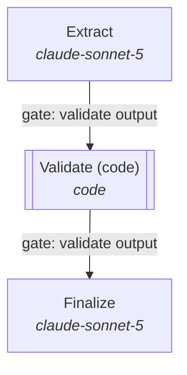

# Architecture recommendation: call_summarization

> Post-call summarisation for a contact centre: summary, intents, commitments and compliance flags posted to the CRM within a minute of call end.

Recommended: **Prompt chain (sequential workflow)** (score +3.2; est. p50 latency ~26s vs budget 60s, ~2x tokens of one call). The repository currently implements **Single model call** (score +0.2, ~9s); the recommendation changes the topology.

## Repository scan: `/Users/saxena/Desktop/ClaudeCode_GIT/AgentTopologyBuilder/case_study/01_call_summarization`

- Files scanned: 8; languages: python (3)
- Frameworks/SDKs: anthropic-sdk
- Tools found: 0
- Knowledge sources: none detected
- Side effects: external-post (irreversible), ticket/crm (irreversible)
- Current topology (as implemented): **single_call** - Model calls without tools or loops.

| Inferred field | Value | Confidence | Reason |
|---|---|---|---|
| tool_count | 0 | 50% | No tool definitions found. |
| tool_calls_per_task | 0 | 60% | No tools found. |
| tool_side_effects | irreversible | 70% | Side-effecting integrations: external-post (irreversible), ticket/crm (irreversible) |
| knowledge_sources | 0 | 50% | No retrieval integrations found. |
| retrieval_depth | none | 50% | Derived from sources (0) and whether a loop can issue follow-up queries. |
| context_tokens_per_task | 2000 | 30% | Rough function of sources and tools; replace with measured input tokens per request. |
| scope_breadth | 1 | 40% | 1 file(s) define system prompts/instructions; routing/handoffs raise this. |
| parallel_subtasks | 1 | 30% | No orchestration detected. |
| steps_predictable | True | 50% | No run-time planning detected. |
| task_complexity | simple | 30% | Defaulted from tool presence. |
| latency_budget_s | 3600.0 | 50% | Batch/cron execution: minutes to hours are acceptable. |
| interaction | single_turn | 50% | Batch jobs are single-shot. |
| verifiability | partial | 50% | Tests or schema validation present. |
| error_recoverability | hard | 50% | Irreversible integrations present. |
| accuracy_priority | 4 | 40% | Irreversible actions raise the cost of errors. |

Evidence (first hits per category):

- **side_effects**: external-post (irreversible) @ `app/crm.py:10`; ticket/crm (irreversible) @ `app/crm.py:1`; ticket/crm (irreversible) @ `app/crm.py:3`
- **frameworks**: anthropic-sdk @ `app/pipeline.py:4`; anthropic-sdk @ `app/pipeline.py:11`
- **serving**: batch/cron @ `app/pipeline.py:5`
- **quality**: structured-output @ `app/pipeline.py:31`

### Gap: current vs. recommended

| | Current: Single model call | Recommended: Prompt chain (sequential workflow) |
|---|---|---|
| Score | +0.2 | +3.2 |
| Est. latency | ~9s | ~26s |
| Est. cost / request | $0.070 | $0.045 |
| Tokens vs one call | 1x | 2x |

## Why this topology

- (+2.5) Steps are predictable: a code-defined chain with gates beats an agent deciding the path (more predictable, cheaper, easier to test). _[Anthropic, Building effective agents]_

## Ranked candidates

| # | Topology | Score | Fit | Latency (p50 est.) | Budget fit | Cost / request | Tokens vs 1 call | LLM calls |
|---|---|---|---|---|---|---|---|---|
| 1 | Prompt chain (sequential workflow) | +3.2 | +2.5 | ~26s | fits | $0.045 | 2x | 4 |
| 2 | Single agent with tools | +1.5 | +1.5 | ~14s | fits | $0.089 | 1x | 2 |
| 3 | Single model call | +0.2 | +0.0 | ~9s | fits | $0.070 | 1x | 1 |
| 4 | Router / classifier dispatch | +0.2 | +0.0 | ~10s | fits | $0.073 | 1x | 2 |
| 5 | Evaluator-optimizer loop | -0.2 | +1.5 | ~44s | tight | $0.193 | 2x | 6 |
| 6 | Parallel voting / ensemble | -0.3 | +1.0 | ~15s | fits | $0.274 | 4x | 6 |
| 7 | Orchestrator + worker subagents | -9.6 | -9.0 | ~40s | fits | $0.082 | 2x | 4 |
| 8 | ~~Parallel sectioning (code-defined fan-out)~~ (not viable: nothing to fan out) | +1.0 | +0.0 | ~17s | fits | $0.036 | 2x | 5 |
| 9 | ~~Specialist handoffs (decentralised)~~ (not viable: no second specialist to hand off to) | -4.8 | -4.0 | ~28s | fits | $0.164 | 2x | 5 |
| 10 | ~~Hierarchical teams (orchestrator -> leads -> workers)~~ (not viable: no domains or sub-task volume to justify two levels) | -16.6 | -13.0 | ~77s | exceeds | $0.242 | 8x | 22 |

Latency/accuracy frontier (no candidate is both faster and a better structural fit): Single model call (~9s, fit +0.0), Single agent with tools (~14s, fit +1.5), Parallel voting / ensemble (~15s, fit +2.5).

## Decomposition plan

Topology: **Prompt chain (sequential workflow)** - Fixed sequence of model steps defined in code, each consuming the previous output, with programmatic gates/checks between steps.

| Component | Role | Model | Effort | Tools | Parallel group |
|---|---|---|---|---|---|
| Extract | Pull candidate fields from the input (tools if needed). | claude-sonnet-5 | high | - | - |
| Validate (code) | Schema and business-rule checks in code; reject or route back. | code | medium | - | - |
| Finalize | Resolve ambiguities and emit the final structured record. | claude-sonnet-5 | high | - | - |

## Model selection per role

Catalog `case-study-ecosystem`; data class **confidential**; policy: verified entries only. Providers used: anthropic. Estimated per request on the chosen models: ~25s, $0.059.

| Role | Needs | Chosen model | Effort | Fallback | Est. per call | Alternatives |
|---|---|---|---|---|---|---|
| extract (stage) | tier ≥3; 30s share; 12,000 ctx; tools; structured | **claude-sonnet-5** | high | claude-haiku-4-5 | ~9.0s, $0.0535 | claude-haiku-4-5 (+1.4), claude-opus-5 (+0.2) |
| finalize (synthesizer) | tier ≥3; 30s share; 5,700 ctx; structured | **claude-sonnet-5** | high | claude-haiku-4-5 | ~5.7s, $0.0154 | claude-haiku-4-5 (+1.4), claude-opus-5 (+0.4) |

- **extract**: Tier 4 vs required 3; est. 9.0s of a 30.0s share; $0.0535 per call. measured extraction accuracy 90%
- **finalize**: Tier 4 vs required 3; est. 5.7s of a 30.0s share; $0.0154 per call. measured extraction accuracy 90%

## Agent report card: call_summarization

Full report card for **call_summarization**: overall **B** (84.7/100). Task complexity 3 (moderate), design 1 (trivial), behaviour 2 (simple). Weakest dimension: Governance and guardrails (F).

| Dimension | Grade | Score | Weight |
|---|---|---|---|
| Outcome quality | **B** | 84.6 | 30 |
| Reliability and control | **B** | 87.5 | 20 |
| Cost and token efficiency | **A** | 100.0 | 15 |
| Latency | **A** | 100.0 | 15 |
| Governance and guardrails | **F** | 30.0 | 10 |
| Complexity fit | **B** | 88.0 | 10 |
| **Overall** | **B** | 84.7 | |

### Complexity

| Axis | Level | Basis |
|---|---|---|
| Task | 3 (moderate) | profile: complexity, breadth, sources, parallel sub-tasks, context pressure |
| Design | 1 (trivial) | 0 tools (0 overlapping), delegation depth 0, 1 prompt definitions (~143 chars) |
| Behaviour | 2 (simple) | steps p50 3.0, p95 3.0, CV 0.0; branching 1.0; 0.0 spawns and 0.0 handoffs per run |

### Mismatches

- **High stakes, little verification** (warn): Only 0% of runs include a verification step for a stakes-4 workload. _Action: Add an evaluator/verifier step (tests, schema checks, or an independent model) before returning._

### Findings by dimension

**Outcome quality** (B)
- Only 78% of repeated tasks agree on outcome across runs: reliability across runs is low (Galileo reports 60% single-run falling to 25% over eight runs).

**Reliability and control** (B)
- High-stakes workload with little verification in traces and no eval harness in code (verification failures are ~25% of multi-agent failures).

**Governance and guardrails** (F)
- No eval harness or tests found: build a ~20-query eval before changing structure.
- Irreversible integrations without an approval or confirmation gate in code.
- No tracing/observability library detected; multi-agent failures cannot be diagnosed without per-turn traces.
- Traces show no human approval steps despite irreversible tools.

**Complexity fit** (B)
- High stakes, little verification

### Behavioural metrics

| Metric | Value |
|---|---|
| Runs / tasks | 120 / 60 |
| Success rate | 88% |
| Consistency across repeated runs | 78% |
| All runs pass (repeated tasks) | 77% |
| Steps per run (p50 / p95 / CV) | 3.0 / 3.0 / 0.0 |
| LLM calls per run (mean) | 3.0 |
| Tool calls per run (mean) | 0.0 |
| Distinct tools used | 0 |
| Tool error rate | 0.0% |
| Runs with repeated identical calls | 0% |
| Runs ended by a limit | 2% |
| Runs ended by error/timeout | 0% |
| Handoffs / spawns per run | 0.0 / 0.0 |
| Runs with verification / human step | 0% / 0% |
| Branching factor | 1.0 |
| Trajectory diversity | 0.0 |
| Tokens per run (mean / p95) | 12,116 / 14,100 |
| Peak context (max) | 4,774 |
| Context growth per step | 400 |
| Latency p50 / p95 | 17.9s / 19.0s |
| Cost per run / per completed task | $0.0329 / $0.0376 |
| Successes per 1k tokens | 0.072 |

### Per-agent cards

| Agent | Role | Model | Grade | Steps p50/p95 | Tool calls | Tool errors | Loops | Tokens/run | Latency p50 | Findings |
|---|---|---|---|---|---|---|---|---|---|---|
| agent | - | - | **A** | 3.0/3.0 | 0.0 | 0% | 0% | 12,116 | 17.9s | stable: no loops, low variance, no tool errors |

## Cross-cutting recommendations

- **Build a ~20-query eval before adding any structure.** Every source agrees: measure a single agent/call first, then add topology only where the eval shows it failing. Above a ~45% single-agent baseline, adding agents tended to hurt in the scaling study. Keep the eval to compare latency and accuracy across topologies. _[Google/MIT, Towards a Science of Scaling Agent Systems]_
- **Prompt caching on the stable prefix (system prompt, tool schemas, reference docs).** Multi-turn and multi-call topologies re-send the same prefix on every call; caching cuts cost up to ~90% and time-to-first-token. _[Anthropic, Effective context engineering for AI agents]_
- **Structured outputs (JSON schema) for routers, extractors and votes.** Removes parsing failures and makes code-side gates and majority votes trivial. _[Anthropic, Building effective agents]_
- **Dedicated, gated tools for irreversible actions with checkpoints/rollback.** Promote side-effecting actions to typed tools so the harness can intercept, confirm, audit and roll back; never let them run through a generic shell tool. _[Anthropic, Building effective agents]_
- **Consider a difficulty router in front.** Send easy requests to a small model and hard ones to the full path; the largest cost lever after caching. _[Anthropic, Building effective agents]_

## Estimate assumptions

- 3 sequential stages with programmatic gates between them.
- Serving assumptions (reference model per capability level from the catalog): claude-opus-5 ~1.5s TTFT, ~55 tok/s; acme-onprem-70b ~0.5s TTFT, ~90 tok/s; claude-haiku-4-5 ~0.6s TTFT, ~140 tok/s; tool call ~0.5s.
- Reading load per task 9,000 tokens (context pressure: low); output type structured_data.
- Latency is the critical path (parallel branches count once); cost sums every call at list prices without caching. Treat both as order-of-magnitude.

## Alternatives

- **Single agent with tools** (score +1.5, ~14s, 1x tokens): A 78% single-agent baseline is the regime where one agent plus a better model/effort/tools wins
- **Single model call** (score +0.2, ~9s, 1x tokens): Classification, extraction, summarisation, Q&A over a bounded context where the steps need no tools and no iteration.
- **Router / classifier dispatch** (score +0.2, ~10s, 1x tokens): Routing easy requests to a small model is the cheapest accuracy-preserving lever
