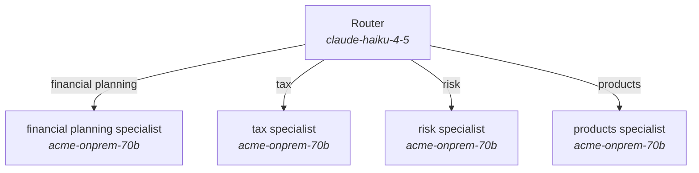

# Architecture recommendation: robo_advisor

> Conversational robo-advisor answering planning, tax, risk and product questions within the firm's methodology and policy, using the client's real portfolio through deterministic APIs and three knowledge bases; compliance-reviewed before answering.

Recommended: **Router / classifier dispatch** (score +1.1; est. p50 latency ~27s vs budget 15s, ~2x tokens of one call). It exceeds the latency budget and no viable topology fits it: relax the budget, cut tool calls/reading per request, use a smaller model, or move work off the request path. The repository currently implements **Evaluator-optimizer loop** (score -5.7, ~82s); the recommendation changes the topology.

## Repository scan: `/Users/saxena/Desktop/ClaudeCode_GIT/AgentTopologyBuilder/case_study/02_robo_advisor`

- Files scanned: 8; languages: python (3)
- Frameworks/SDKs: anthropic-sdk, langgraph
- Tools found: 10 (contribution_limits, create_proposal, get_portfolio, market_data, risk_score, search_methodology, search_policy, search_products, suitability_check, tax_lots)
- Knowledge sources: elasticsearch
- Side effects: external-post (irreversible)
- Current topology (as implemented): **evaluator_optimizer** - Generator with an evaluator/critic and iteration cap.

| Inferred field | Value | Confidence | Reason |
|---|---|---|---|
| tool_count | 10 | 80% | 10 tool definitions found (decorators, schemas, MCP tools, OpenAPI operations). |
| tool_calls_per_task | 6 | 30% | Rough: 10 tools and 0 tool-handling call sites; verify against traces. |
| tool_dependency | sequential | 40% | No concurrency primitives around tool calls. |
| tool_side_effects | irreversible | 70% | Side-effecting integrations: external-post (irreversible) |
| knowledge_sources | 1 | 60% | Retrieval integrations: elasticsearch |
| retrieval_depth | multi_hop | 50% | Derived from sources (1) and whether a loop can issue follow-up queries. |
| context_tokens_per_task | 23000 | 30% | Rough function of sources and tools; replace with measured input tokens per request. |
| scope_breadth | 1 | 40% | 1 file(s) define system prompts/instructions; routing/handoffs raise this. |
| parallel_subtasks | 1 | 40% | Single tool loop. |
| steps_predictable | False | 60% | The model chooses steps at run time. |
| task_complexity | complex | 40% | Tool loop with 10 tools. |
| latency_budget_s | 8.0 | 40% | Request/response serving implies an interactive budget. |
| interaction | multi_turn | 40% | Serving surface and memory usage. |
| verifiability | strong | 60% | Eval harness present. |
| human_in_loop | True | 60% | Approval/confirmation logic present. |
| error_recoverability | hard | 50% | Irreversible integrations present. |
| accuracy_priority | 4 | 40% | Irreversible actions raise the cost of errors. |
| tool_overlap | True | 50% | Similarly named tools: search_methodology, search_policy, search_products |

Evidence (first hits per category):

- **agent_patterns**: evaluator loop @ `evals/run_eval.py:1`; evaluator loop @ `evals/run_eval.py:7`; tool runner @ `app/advisor.py:23`; tool runner @ `app/advisor.py:27`; evaluator loop @ `app/advisor.py:1`; evaluator loop @ `app/advisor.py:14`
- **quality**: evals @ `evals/run_eval.py:1`; observability/tracing @ `evals/run_eval.py:1`; human-approval @ `app/advisor.py:34`; memory @ `app/advisor.py:4`
- **frameworks**: anthropic-sdk @ `app/advisor.py:2`; anthropic-sdk @ `app/advisor.py:10`; langgraph @ `app/advisor.py:4`; anthropic-sdk @ `app/tools.py:3`
- **serving**: http-api @ `app/advisor.py:9`
- **tools**: python decorator tool @ `app/tools.py:9`; python decorator tool @ `app/tools.py:15`; python decorator tool @ `app/tools.py:21`; python decorator tool @ `app/tools.py:27`; python decorator tool @ `app/tools.py:33`
- **retrieval**: elasticsearch @ `app/tools.py:4`; elasticsearch @ `app/tools.py:6`
- **side_effects**: external-post (irreversible) @ `app/tools.py:36`; external-post (irreversible) @ `app/tools.py:66`

### Gap: current vs. recommended

| | Current: Evaluator-optimizer loop | Recommended: Router / classifier dispatch |
|---|---|---|
| Score | -5.7 | +1.1 |
| Est. latency | ~82s | ~27s |
| Est. cost / request | $0.673 | $0.414 |
| Tokens vs one call | 2x | 2x |

Why the current topology scores lower:
- (-1.0) Tight budget: extra serial hops (planning, synthesis, critique) are expensive in wall-clock time. _[Anthropic, How we built our multi-agent research system]_

## Why this topology

- (+2.7) 4 distinct domains: route each request to a specialist prompt/agent instead of one prompt carrying every domain's instructions and tools. _[OpenAI, A practical guide to building agents]_
- (+1.5) Routing to specialists gives each a small, non-overlapping tool set. _[OpenAI, A practical guide to building agents]_

## Ranked candidates

| # | Topology | Score | Fit | Latency (p50 est.) | Budget fit | Cost / request | Tokens vs 1 call | LLM calls |
|---|---|---|---|---|---|---|---|---|
| 1 | Router / classifier dispatch | +1.1 | +4.2 | ~27s | exceeds | $0.414 | 2x | 4 |
| 2 | Parallel sectioning (code-defined fan-out) | -0.1 | +0.7 | ~20s | exceeds | $0.045 | 1x | 5 |
| 3 | Orchestrator + worker subagents | -1.3 | +1.5 | ~46s | far over | $0.104 | 2x | 10 |
| 4 | Single agent with tools | -1.6 | +1.5 | ~26s | exceeds | $0.411 | 2x | 3 |
| 5 | Specialist handoffs (decentralised) | -3.9 | +0.0 | ~38s | far over | $0.431 | 2x | 5 |
| 6 | Parallel voting / ensemble | -4.6 | +0.0 | ~28s | exceeds | $2.067 | 8x | 15 |
| 7 | Prompt chain (sequential workflow) | -4.6 | -2.0 | ~40s | far over | $0.097 | 2x | 6 |
| 8 | Evaluator-optimizer loop | -5.7 | -1.0 | ~82s | far over | $0.673 | 2x | 10 |
| 9 | Hierarchical teams (orchestrator -> leads -> workers) | -11.2 | -7.0 | ~74s | far over | $0.404 | 3x | 26 |
| 10 | ~~Single model call~~ (not viable: needs tool calls; a single call cannot act) | -5.0 | -4.0 | ~9s | fits | $0.250 | 1x | 1 |

Latency/accuracy frontier (no candidate is both faster and a better structural fit): Parallel sectioning (code-defined fan-out) (~20s, fit +0.7), Single agent with tools (~26s, fit +1.5), Router / classifier dispatch (~27s, fit +4.2).

## Decomposition plan

Topology: **Router / classifier dispatch** - A cheap classification step assigns each request to one of several specialised prompts, agents or models.

| Component | Role | Model | Effort | Tools | Parallel group |
|---|---|---|---|---|---|
| Router | Classifies the request into one category (small model, structured output). | claude-haiku-4-5 | n/a | - | - |
| financial planning specialist | Handles 'financial planning' requests with only that domain's instructions and tools. | acme-onprem-70b | n/a | contribution_limits, create_proposal, get_portfolio, market_data, risk_score, search_methodology, search_policy, search_products, suitability_check, tax_lots | - |
| tax specialist | Handles 'tax' requests with only that domain's instructions and tools. | acme-onprem-70b | n/a | contribution_limits, create_proposal, get_portfolio, market_data, risk_score, search_methodology, search_policy, search_products, suitability_check, tax_lots | - |
| risk specialist | Handles 'risk' requests with only that domain's instructions and tools. | acme-onprem-70b | n/a | contribution_limits, create_proposal, get_portfolio, market_data, risk_score, search_methodology, search_policy, search_products, suitability_check, tax_lots | - |
| products specialist | Handles 'products' requests with only that domain's instructions and tools. | acme-onprem-70b | n/a | contribution_limits, create_proposal, get_portfolio, market_data, risk_score, search_methodology, search_policy, search_products, suitability_check, tax_lots | - |

## Model selection per role

Catalog `case-study-ecosystem`; data class **confidential**; policy: verified entries only. Providers used: anthropic, self_hosted. Estimated per request on the chosen models: ~16s, $0.023.

| Role | Needs | Chosen model | Effort | Fallback | Est. per call | Alternatives |
|---|---|---|---|---|---|---|
| router (router) | tier ≥2; 2s share; 4,500 ctx; structured | **claude-haiku-4-5** | n/a | claude-sonnet-5 | ~0.8s, $0.0046 | claude-sonnet-5 (+1.2), claude-opus-5 (+0.4) |
| handler_1 (handler) | tier ≥5; 13s share; 49,500 ctx; tools | **acme-onprem-70b** | n/a | claude-sonnet-5 | ~10.0s, $0.0376 | claude-sonnet-5 (+0.6), claude-opus-5 (-1.1) |
| handler_2 (handler) | tier ≥5; 13s share; 49,500 ctx; tools | **acme-onprem-70b** | n/a | claude-sonnet-5 | ~10.0s, $0.0376 | claude-sonnet-5 (+0.6), claude-opus-5 (-1.1) |
| handler_3 (handler) | tier ≥5; 13s share; 49,500 ctx; tools | **acme-onprem-70b** | n/a | claude-sonnet-5 | ~10.0s, $0.0376 | claude-sonnet-5 (+0.6), claude-opus-5 (-1.1) |
| handler_4 (handler) | tier ≥5; 13s share; 49,500 ctx; tools | **acme-onprem-70b** | n/a | claude-sonnet-5 | ~10.0s, $0.0376 | claude-sonnet-5 (+0.6), claude-opus-5 (-1.1) |

- **router**: Tier 3 vs required 2; est. 0.8s of a 1.5s share; $0.0046 per call. measured classification accuracy 93%
- **handler_1**: Tier 4 vs required 5; est. 10.0s of a 12.8s share; $0.0376 per call. measured conversation accuracy 90% Fallback claude-sonnet-5 is on a different provider for outage/refusal resilience.
- **handler_2**: Tier 4 vs required 5; est. 10.0s of a 12.8s share; $0.0376 per call. measured conversation accuracy 90% Fallback claude-sonnet-5 is on a different provider for outage/refusal resilience.
- **handler_3**: Tier 4 vs required 5; est. 10.0s of a 12.8s share; $0.0376 per call. measured conversation accuracy 90% Fallback claude-sonnet-5 is on a different provider for outage/refusal resilience.
- **handler_4**: Tier 4 vs required 5; est. 10.0s of a 12.8s share; $0.0376 per call. measured conversation accuracy 90% Fallback claude-sonnet-5 is on a different provider for outage/refusal resilience.

## Agent report card: robo_advisor

Full report card for **robo_advisor**: overall **F** (54.1/100). Task complexity 5 (open-ended), design 4 (complex), behaviour 5 (open-ended). Priority: Loops without limits. Weakest dimension: Latency (F). Agents needing attention: agent.

| Dimension | Grade | Score | Weight |
|---|---|---|---|
| Outcome quality | **F** | 43.8 | 30 |
| Reliability and control | **F** | 39.8 | 20 |
| Cost and token efficiency | **A** | 90.0 | 15 |
| Latency | **F** | 36.3 | 15 |
| Governance and guardrails | **C** | 70.0 | 10 |
| Complexity fit | **C** | 71.0 | 10 |
| **Overall** | **F** | 54.1 | |

### Complexity

| Axis | Level | Basis |
|---|---|---|
| Task | 5 (open-ended) | profile: complexity, breadth, sources, parallel sub-tasks, context pressure |
| Design | 4 (complex) | 10 tools (3 overlapping), delegation depth 0, evaluator loop, 1 prompt definitions (~132 chars) |
| Behaviour | 5 (open-ended) | steps p50 8.0, p95 22.05, CV 0.58; branching 2.43; 0.0 spawns and 0.0 handoffs per run |

### Mismatches

- **Loops without limits** (high): Repetition in 31% of runs, 9% hit a limit, and no termination limits are in code. _Action: Add max turns/tool calls/iterations and explicit stop criteria; cache identical tool calls._
- **Overlapping tools** (info): 3 tools share a name stem (search_methodology, search_policy, search_products). _Action: Consolidate or namespace tools; overlap, not count, is what confuses agents (OpenAI)._

### Findings by dimension

**Outcome quality** (F)
- Only 35% of repeated tasks agree on outcome across runs: reliability across runs is low (Galileo reports 60% single-run falling to 25% over eight runs).
- Measured success 48% is below the stated single-agent baseline 61%: the added structure is not paying for itself.
- Success 48% is above the ~45% capability-saturation threshold: adding agents is unlikely to help; improve model, prompt or tools instead.

**Reliability and control** (F)
- 31% of runs repeat an identical tool call (step repetition is 15.7% of multi-agent failures in MAST). Add a result cache or a rule against re-calling with the same arguments.
- 9% of runs end by hitting a step or recursion limit: the agent does not know when it is done ('unaware of termination', 12.4% of failures). Add explicit stop criteria to the prompt and check the limit is not too low.
- Tool error rate 10%: return `is_error` results the model can act on, and add retries with backoff in the harness.

**Latency** (F)
- Median latency 22.1s exceeds the 15s budget.
- p95 latency 44.4s is 3.0x the budget: the tail is driven by long tool chains or loops.

**Governance and guardrails** (C)
- Loops or delegation without termination limits in code.
- High-stakes outputs without schema-validated structured output.
- Traces show no human approval steps despite irreversible tools.

**Complexity fit** (C)
- Loops without limits
- Overlapping tools

### Behavioural metrics

| Metric | Value |
|---|---|
| Runs / tasks | 80 / 40 |
| Success rate | 48% |
| Consistency across repeated runs | 35% |
| All runs pass (repeated tasks) | 15% |
| Steps per run (p50 / p95 / CV) | 8.0 / 22.05 / 0.58 |
| LLM calls per run (mean) | 5.05 |
| Tool calls per run (mean) | 4.75 |
| Distinct tools used | 5 |
| Tool error rate | 9.7% |
| Runs with repeated identical calls | 31% |
| Runs ended by a limit | 9% |
| Runs ended by error/timeout | 8% |
| Handoffs / spawns per run | 0.0 / 0.0 |
| Runs with verification / human step | 100% / 0% |
| Branching factor | 2.43 |
| Trajectory diversity | 0.5 |
| Tokens per run (mean / p95) | 67,584 / 145,937 |
| Peak context (max) | 25,510 |
| Context growth per step | 1,107 |
| Latency p50 / p95 | 22.1s / 44.4s |
| Cost per run / per completed task | $0.1386 / $0.2918 |
| Successes per 1k tokens | 0.007 |

### Per-agent cards

| Agent | Role | Model | Grade | Steps p50/p95 | Tool calls | Tool errors | Loops | Tokens/run | Latency p50 | Findings |
|---|---|---|---|---|---|---|---|---|---|---|
| agent | - | - | **D** | 7.0/20.05 | 4.75 | 10% | 31% | 65,243 | 19.3s | tool error rate 10%; repeats identical tool calls in 31% of runs |
| evaluator | - | - | **A** | 1.0/2.0 | 0.0 | 0% | 0% | 2,341 | 1.4s | stable: no loops, low variance, no tool errors |

## Cross-cutting recommendations

- **Build a ~20-query eval before adding any structure.** Every source agrees: measure a single agent/call first, then add topology only where the eval shows it failing. Above a ~45% single-agent baseline, adding agents tended to hurt in the scaling study. Keep the eval to compare latency and accuracy across topologies. _[Google/MIT, Towards a Science of Scaling Agent Systems]_
- **Prompt caching on the stable prefix (system prompt, tool schemas, reference docs).** Multi-turn and multi-call topologies re-send the same prefix on every call; caching cuts cost up to ~90% and time-to-first-token. _[Anthropic, Effective context engineering for AI agents]_
- **Structured outputs (JSON schema) for routers, extractors and votes.** Removes parsing failures and makes code-side gates and majority votes trivial. _[Anthropic, Building effective agents]_
- **Parallel tool use inside each agent turn.** Independent tool calls issued in one assistant turn cut rounds by 2-4x; return all results in one message. _[Anthropic, Effective context engineering for AI agents]_
- **Context editing (clear stale tool results/thinking).** Keeps long loops lean without summarisation losses. _[Anthropic, Effective context engineering for AI agents]_
- **Memory across sessions (file/DB-backed).** State that must outlive one conversation should be written to memory, not carried in context. _[Anthropic, Effective context engineering for AI agents]_
- **Dedicated, gated tools for irreversible actions with human approval.** Promote side-effecting actions to typed tools so the harness can intercept, confirm, audit and roll back; never let them run through a generic shell tool. _[Anthropic, Building effective agents]_
- **Model tiering: large model for planning/synthesis, smaller models for reading/routing.** Reading-heavy workers and routers need many input tokens and little judgment; run them on Sonnet/Haiku and keep Opus for the lead. _[Anthropic, Managed Agents multiagent guidance]_
- **Agentic retrieval capped at ~4 iterations: start broad, then narrow.** Multi-hop retrieval buys accuracy (27% -> 43% EM on HotpotQA) at 3-20x latency; cap the loop and prefer short broad queries first, narrowing progressively. _[Agentic vs classic RAG guidance (see docs/industry_guidance.html)]_

## Estimate assumptions

- Small-model router (~20 output tokens) then one specialist handler.
- Serving assumptions (reference model per capability level from the catalog): claude-opus-5 ~1.5s TTFT, ~55 tok/s; acme-onprem-70b ~0.5s TTFT, ~90 tok/s; claude-haiku-4-5 ~0.6s TTFT, ~140 tok/s; tool call ~0.4s.
- Reading load per task 45,000 tokens (context pressure: medium); output type short_answer.
- Latency is the critical path (parallel branches count once); cost sums every call at list prices without caching. Treat both as order-of-magnitude.

## Alternatives

- **Parallel sectioning (code-defined fan-out)** (score -0.1, ~20s, 1x tokens): Some of the fan-out can still be code-defined if a stable first split exists
- **Orchestrator + worker subagents** (score -1.3, ~46s, 2x tokens): Several domains inside one request: a lead delegates to domain specialists with narrow prompts and tool sets; ~2 independent sub-tasks discovered at run time: orchestrator spawns parallel subagents, each in its own context
- **Single agent with tools** (score -1.6, ~26s, 2x tokens): Unpredictable path: the model must choose steps at run time, which is the definition of an agent; Multi-hop retrieval: the model must decide follow-up queries from earlier results (agentic retrieval)
