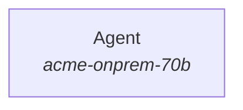

# Architecture recommendation: account_inquiry

> In-app assistant answering questions about account balances, cost basis, contributions and balance changes from deterministic books-and-records APIs, with FAQ explanations.

Recommended: **Single agent with tools** (score +2.1; est. p50 latency ~7s vs budget 5s, ~1x tokens of one call). It exceeds the latency budget and no viable topology fits it: relax the budget, cut tool calls/reading per request, use a smaller model, or move work off the request path. This matches the topology the repository already implements; focus on the cross-cutting recommendations.

## Repository scan: `/Users/saxena/Desktop/ClaudeCode_GIT/AgentTopologyBuilder/case_study/03_account_inquiry`

- Files scanned: 7; languages: python (3)
- Frameworks/SDKs: anthropic-sdk
- Tools found: 7 (explain_balance_change, faq_lookup, get_balances, get_contributions_ytd, get_cost_basis, get_positions, get_transactions)
- Knowledge sources: pgvector, sql
- Side effects: none detected
- Current topology (as implemented): **single_agent** - A tool-use loop (or tool definitions) with no delegation.

| Inferred field | Value | Confidence | Reason |
|---|---|---|---|
| tool_count | 7 | 80% | 7 tool definitions found (decorators, schemas, MCP tools, OpenAPI operations). |
| tool_calls_per_task | 4 | 30% | Rough: 7 tools and 0 tool-handling call sites; verify against traces. |
| tool_dependency | sequential | 40% | No concurrency primitives around tool calls. |
| tool_side_effects | read_only | 60% | No write/side-effect integrations detected. |
| knowledge_sources | 2 | 60% | Retrieval integrations: pgvector, sql |
| retrieval_depth | multi_hop | 50% | Derived from sources (2) and whether a loop can issue follow-up queries. |
| context_tokens_per_task | 24500 | 30% | Rough function of sources and tools; replace with measured input tokens per request. |
| scope_breadth | 1 | 40% | 1 file(s) define system prompts/instructions; routing/handoffs raise this. |
| parallel_subtasks | 1 | 40% | Single tool loop. |
| steps_predictable | False | 60% | The model chooses steps at run time. |
| task_complexity | moderate | 40% | Tool loop with 7 tools. |
| latency_budget_s | 10.0 | 40% | Request/response serving implies an interactive budget. |
| interaction | single_turn | 40% | Serving surface and memory usage. |
| verifiability | partial | 50% | Tests or schema validation present. |
| tool_overlap | True | 50% | Similarly named tools: get_balances, get_contributions_ytd, get_cost_basis, get_positions, get_transactions |

Evidence (first hits per category):

- **frameworks**: anthropic-sdk @ `app/assistant.py:2`; anthropic-sdk @ `app/assistant.py:10`; anthropic-sdk @ `app/tools.py:3`
- **agent_patterns**: tool runner @ `app/assistant.py:24`; tool runner @ `app/assistant.py:28`
- **serving**: http-api @ `app/assistant.py:9`; websocket/streaming @ `app/assistant.py:1`
- **tools**: python decorator tool @ `app/tools.py:7`; python decorator tool @ `app/tools.py:13`; python decorator tool @ `app/tools.py:19`; python decorator tool @ `app/tools.py:25`; python decorator tool @ `app/tools.py:31`
- **retrieval**: pgvector @ `app/tools.py:4`; pgvector @ `app/tools.py:45`; sql @ `app/tools.py:4`
- **quality**: tests @ `tests/test_numbers_match.py:1`

## Why this topology

- (+2.0) Simple task with a few tools: a single agent loop is enough. _[OpenAI, A practical guide to building agents]_
- (+2.0) Unpredictable path: the model must choose steps at run time, which is the definition of an agent. _[Anthropic, Building effective agents]_
- (+2.0) Multi-hop retrieval: the model must decide follow-up queries from earlier results (agentic retrieval). _[Anthropic, Effective context engineering for AI agents]_
- (+2.0) A 88% single-agent baseline is the regime where one agent plus a better model/effort/tools wins. _[Google/MIT, Towards a Science of Scaling Agent Systems]_

Counter-signals to keep in mind:
- (-1.5) Serial round trips do not fit an interactive budget. _[Anthropic, Building effective agents]_
- (-1.5) Overlapping tools are OpenAI's split trigger (systems fail with <10 overlapping tools yet manage 15+ distinct ones): first consolidate/rename tools; if that fails, give each specialist a disjoint tool set. _[OpenAI, A practical guide to building agents]_
- (-1.5) Agentic retrieval loops run 3-20x the latency of single-pass RAG; an interactive budget forces single-pass retrieval with escalation only on failure signals (adaptive RAG). _[Agentic vs classic RAG guidance (see docs/industry_guidance.html)]_

## Ranked candidates

| # | Topology | Score | Fit | Latency (p50 est.) | Budget fit | Cost / request | Tokens vs 1 call | LLM calls |
|---|---|---|---|---|---|---|---|---|
| 1 | Single agent with tools | +2.1 | +3.5 | ~7s | exceeds | $0.003 | 1x | 2 |
| 2 | Router / classifier dispatch | +1.2 | +3.0 | ~7s | exceeds | $0.004 | 2x | 3 |
| 3 | Parallel voting / ensemble | -2.9 | +1.0 | ~8s | exceeds | $0.017 | 7x | 10 |
| 4 | Evaluator-optimizer loop | -6.1 | -1.5 | ~31s | far over | $0.011 | 4x | 9 |
| 5 | Prompt chain (sequential workflow) | -6.7 | -3.5 | ~18s | far over | $0.005 | 2x | 3 |
| 6 | Orchestrator + worker subagents | -16.9 | -12.5 | ~30s | far over | $0.009 | 3x | 6 |
| 7 | ~~Single model call~~ (not viable: needs tool calls; a single call cannot act) | -1.0 | -2.0 | ~2s | fits | $0.002 | 1x | 1 |
| 8 | ~~Parallel sectioning (code-defined fan-out)~~ (not viable: nothing to fan out) | -3.3 | +0.0 | ~11s | far over | $0.007 | 3x | 5 |
| 9 | ~~Specialist handoffs (decentralised)~~ (not viable: no second specialist to hand off to) | -10.3 | -7.0 | ~12s | far over | $0.006 | 3x | 5 |
| 10 | ~~Hierarchical teams (orchestrator -> leads -> workers)~~ (not viable: no domains or sub-task volume to justify two levels) | -25.7 | -20.0 | ~47s | far over | $0.020 | 7x | 14 |

Latency/accuracy frontier (no candidate is both faster and a better structural fit): Single agent with tools (~7s, fit +5.0).

## Decomposition plan

Topology: **Single agent with tools** - One model in a tool-use loop: it decides which tools to call, reads results, and iterates until done.

| Component | Role | Model | Effort | Tools | Parallel group |
|---|---|---|---|---|---|
| Agent | Plans and executes the whole task in one tool-use loop. | acme-onprem-70b | n/a | explain_balance_change, faq_lookup, get_balances, get_contributions_ytd, get_cost_basis, get_positions, get_transactions | - |

## Model selection per role

Catalog `case-study-ecosystem`; data class **restricted**; policy: verified entries only. Providers used: self_hosted. Estimated per request on the chosen models: ~7s, $0.003.

| Role | Needs | Chosen model | Effort | Fallback | Est. per call | Alternatives |
|---|---|---|---|---|---|---|
| agent (single_agent) | tier ≥3; 5s share; 10,050 ctx; tools | **acme-onprem-70b** | n/a | - | ~5.0s, $0.0053 | - |

- **agent**: Tier 4 vs required 3; est. 5.0s of a 5.0s share; $0.0053 per call. measured conversation accuracy 90%

## Cross-cutting recommendations

- **Build a ~20-query eval before adding any structure.** Every source agrees: measure a single agent/call first, then add topology only where the eval shows it failing. Above a ~45% single-agent baseline, adding agents tended to hurt in the scaling study. Keep the eval to compare latency and accuracy across topologies. _[Google/MIT, Towards a Science of Scaling Agent Systems]_
- **Explicit termination limits on every loop.** Max turns/tool calls per agent, max evaluator iterations, max handoffs, max concurrent subagents. 'Unaware of termination' and 'step repetition' account for ~28% of multi-agent failures in MAST. _[Cemri et al., Why do multi-agent LLM systems fail? (MAST)]_
- **Stream responses.** Perceived latency drops to time-to-first-token; long outputs must stream to avoid timeouts. _[Anthropic, Effective context engineering for AI agents]_
- **Prompt caching on the stable prefix (system prompt, tool schemas, reference docs).** Multi-turn and multi-call topologies re-send the same prefix on every call; caching cuts cost up to ~90% and time-to-first-token. _[Anthropic, Effective context engineering for AI agents]_
- **Parallel tool use inside each agent turn.** Independent tool calls issued in one assistant turn cut rounds by 2-4x; return all results in one message. _[Anthropic, Effective context engineering for AI agents]_
- **Context editing (clear stale tool results/thinking).** Keeps long loops lean without summarisation losses. _[Anthropic, Effective context engineering for AI agents]_
- **Memory across sessions (file/DB-backed).** State that must outlive one conversation should be written to memory, not carried in context. _[Anthropic, Effective context engineering for AI agents]_
- **Agentic retrieval capped at ~4 iterations: start broad, then narrow.** Multi-hop retrieval buys accuracy (27% -> 43% EM on HotpotQA) at 3-20x latency; cap the loop and prefer short broad queries first, narrowing progressively. _[Agentic vs classic RAG guidance (see docs/industry_guidance.html)]_
- **Adaptive RAG: single-pass by default, escalate on failure signals.** Route simple queries to one retrieval; escalate to the multi-hop loop only on missing citations, low retrieval confidence, contradictions or repeated follow-ups. _[Agentic vs classic RAG guidance (see docs/industry_guidance.html)]_
- **Consider a difficulty router in front.** Send easy requests to a small model and hard ones to the full path; the largest cost lever after caching. _[Anthropic, Building effective agents]_

## Estimate assumptions

- 1 sequential tool round(s) for 2 tool calls (batching by dependency=independent).
- Serving assumptions (reference model per capability level from the catalog): acme-onprem-70b ~0.5s TTFT, ~90 tok/s; acme-onprem-70b ~0.5s TTFT, ~90 tok/s; acme-onprem-70b ~0.5s TTFT, ~90 tok/s; tool call ~0.3s.
- Reading load per task 6,000 tokens (context pressure: low); output type short_answer.
- Latency is the critical path (parallel branches count once); cost sums every call at list prices without caching. Treat both as order-of-magnitude.

## Alternatives

- **Router / classifier dispatch** (score +1.2, ~7s, 2x tokens): Routing to specialists gives each a small, non-overlapping tool set; Routing easy requests to a small model is the cheapest accuracy-preserving lever
- **Parallel voting / ensemble** (score -2.9, ~8s, 7x tokens): High-stakes bounded decision: several independent votes/judges raise confidence at parallel (not serial) latency cost
- **Evaluator-optimizer loop** (score -6.1, ~31s, 4x tokens): High accuracy priority and an objective check: generate -> evaluate -> refine converts test/rubric feedback into measurable gains
